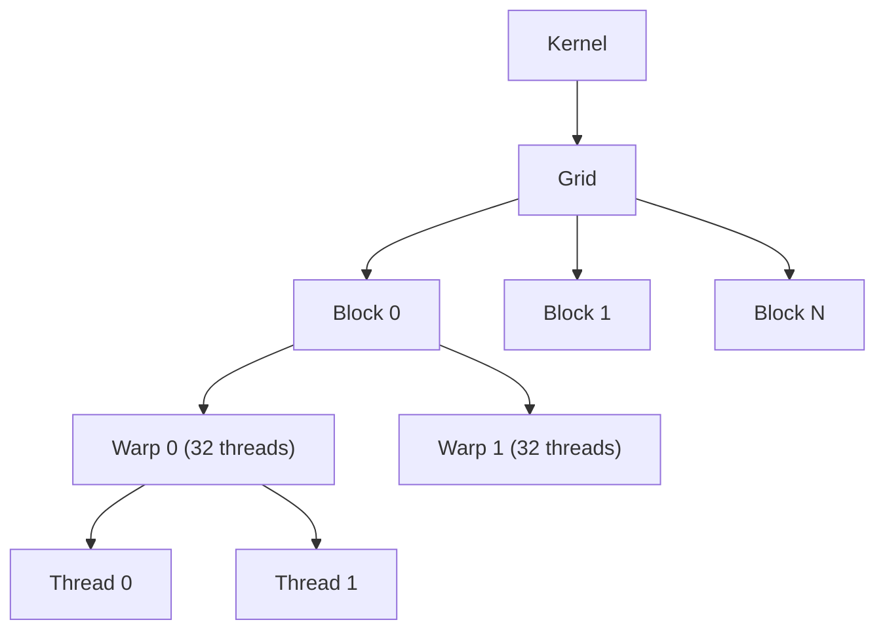
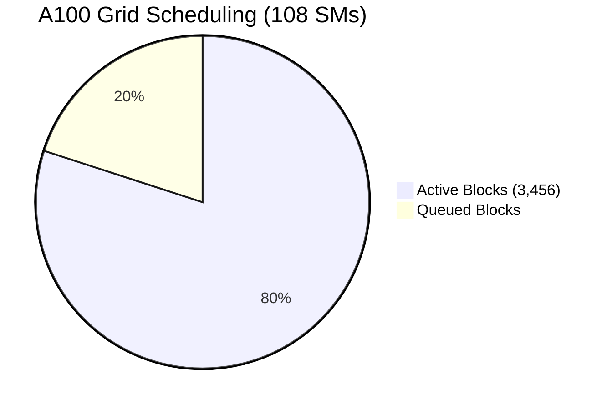

# **GPU Thread Hierarchy: From Threads to Grids in Modern GPUs (A100 & H100)**

This expanded guide explains how **threads, warps, blocks, and grids** are structured in modern GPUs (NVIDIA A100 & H100), including:
- **Total thread count calculations**
- **Grid distribution mechanics**
- **Memory hierarchy impacts**
- **Programming best practices**

---

## **1. Thread Hierarchy & Total Thread Count Calculation**
### **Step-by-Step Calculation for A100 & H100**
We calculate the **maximum theoretical concurrent threads** a GPU can handle:

#### **Formula:**
```
Total Threads = 
  (Number of SMs) × 
  (Max Threads per SM) × 
  (Occupancy Factor)
```

#### **Example: NVIDIA A100 (GA100)**
| Component          | Value                     |
|--------------------|---------------------------|
| **SMs**            | 108                       |
| **Max Threads/SM** | 2048 (limited by registers) |
| **Occupancy**      | ~100% (ideal case)        |

**Total Threads = 108 × 2048 = 221,184 concurrent threads**

#### **Example: NVIDIA H100 (GH100)**
| Component          | Value                     |
|--------------------|---------------------------|
| **SMs**            | 144                       |
| **Max Threads/SM** | 2048                      |
| **Occupancy**      | ~100%                     |

**Total Threads = 144 × 2048 = 294,912 concurrent threads**

> **Note**: Real-world occupancy depends on kernel resource usage (registers/shared memory).

---

## **2. Grids: Distribution & Maximum Count**
### **What is a Grid?**
- A **grid** is a collection of **thread blocks** that execute a kernel.
- Blocks are distributed across SMs dynamically.

### **Grid Limits in A100 & H100**
| GPU   | Max Blocks per Grid | Max Threads per Grid |
|-------|---------------------|----------------------|
| A100  | 2³¹ - 1 (~2B)       | 2³² - 1 (~4B)        |
| H100  | 2³¹ - 1 (~2B)       | 2³² - 1 (~4B)        |

### **How Grids are Scheduled**
1. **Block Distribution**:
   - The GPU scheduler assigns blocks to SMs.
   - Each SM can hold **up to 32 blocks** (A100/H100).
   - If more blocks exist than SMs can handle, they queue.

2. **Example: A100 with 108 SMs**
   - **Max concurrent blocks = 108 × 32 = 3,456 blocks**.
   - If a grid has **10,000 blocks**, they execute in waves.

3. **Warp Scheduling**:
   - Each SM runs **64 warps (2048 threads)** concurrently.
   - Warps are time-sliced if more exist than hardware supports.

---

## **3. Memory Hierarchy & Limitations**
### **A100 vs. H100 Memory Systems**
| Memory Type       | A100 (GA100)       | H100 (GH100)       | Limitation                     |
|-------------------|--------------------|--------------------|--------------------------------|
| **Registers**     | 256 KB/SM          | 256 KB/SM          | ~255 registers/thread (FP32)   |
| **Shared Mem**    | 164 KB/SM          | 228 KB/SM          | Configurable (L1 vs. Shared)   |
| **L2 Cache**      | 40 MB              | 50 MB              | Shared across all SMs          |
| **HBM2/GDDR6**    | 80 GB (A100 80GB)  | 80 GB (H100 SXM5)  | Bandwidth: ~2 TB/s (H100)      |

---

## **4. Mermaid Diagrams**
### **GPU Execution Pipeline**



### **Grid Distribution Across SMs**


---

## **5. Programming Best Practices**
### **Optimal Block & Grid Sizing**
```cpp
// Example: Matrix Multiplication
dim3 blocks(256, 1);  // 256 threads per block
dim3 grid((matrix_width + 255)/256, matrix_height);

matrixMul<<<grid, blocks>>>(A, B, C);
```

#### **Key Rules**:
1. **Block Size**:
   - **256-1024 threads** (avoids underutilization).
   - Must be a multiple of **32** (warp size).

2. **Grid Size**:
   - Should fully utilize all SMs.
   - For A100: ≥ **108 blocks** (1 per SM).

3. **Avoiding Grid Limits**:
   - For large problems, use **grid-stride loops**:
     ```cpp
     for (int i = blockIdx.x * blockDim.x + threadIdx.x; 
          i < N; 
          i += blockDim.x * gridDim.x) {
       // Parallel work
     }
     ```

---

## **6. Summary**
| Component      | A100 (GA100)      | H100 (GH100)      |
|---------------|-------------------|-------------------|
| **SMs**       | 108               | 144               |
| **Max Threads** | 221,184         | 294,912           |
| **Max Blocks/Grid** | ~2B         | ~2B              |
| **Shared Mem** | 164 KB/SM         | 228 KB/SM         |

### **Key Takeaways**:
1. **Total threads** = SMs × Threads/SM (A100: 221K, H100: 295K).
2. **Grids** can have billions of blocks but execute in waves.
3. **Occupancy** depends on register/shared memory usage.
4. **H100** improves SM count (+33%) and memory bandwidth.

By optimizing **block/grid dimensions** and **memory access**, developers can fully leverage modern GPU architectures. 🚀
