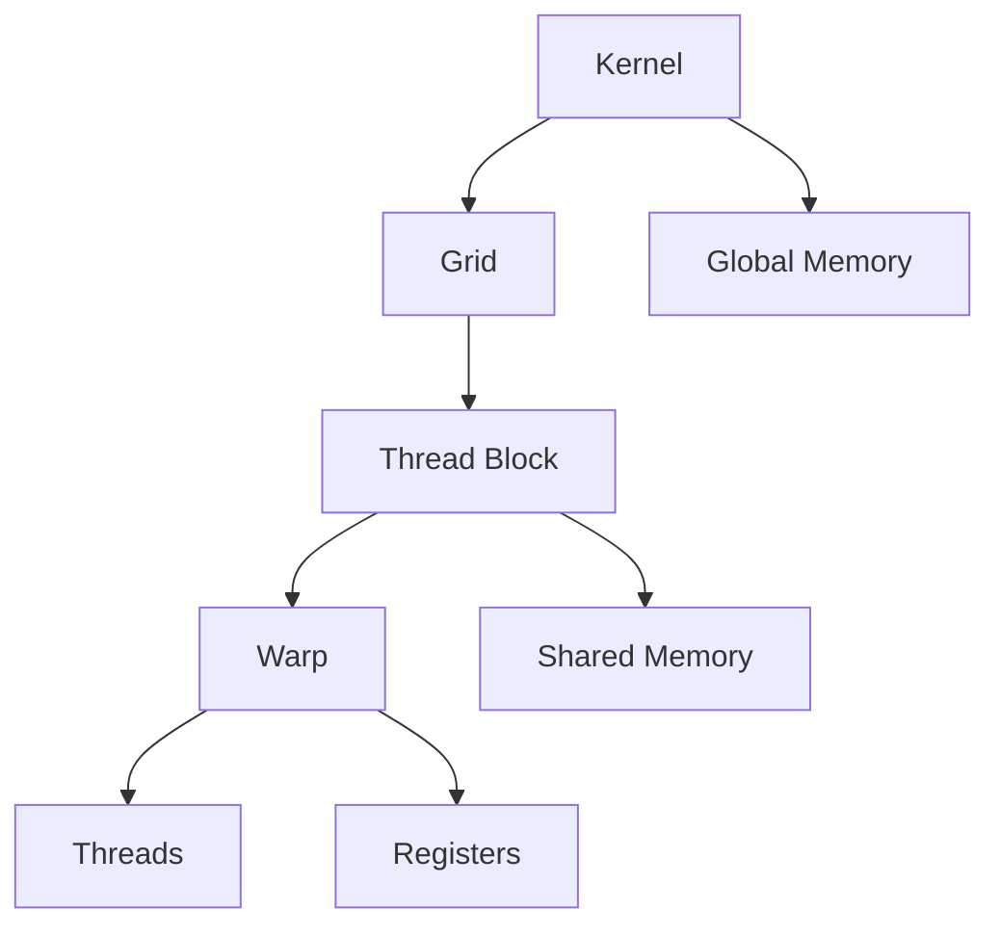
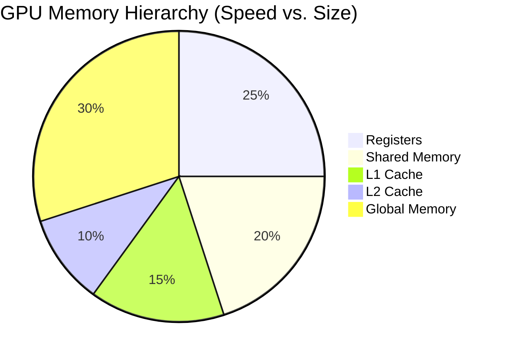

# **Understanding GPU Architecture: Threads, Warps, Blocks, Grids, and SMs in Modern GPUs**

Modern GPUs are highly parallel processors designed for massive computational workloads. To efficiently utilize them, developers must understand their hierarchical execution model, which consists of **threads, warps, thread blocks, grids, and Streaming Multiprocessors (SMs)**. This article explains how these components interconnect, their memory hierarchies, and how to programmatically manage them, with examples from modern GPUs like **NVIDIA’s Ampere (A100) and Hopper (H100)**.

---

## **1. GPU Execution Hierarchy**
The GPU execution model follows a structured hierarchy:

1. **Thread** → 2. **Warp** → 3. **Thread Block** → 4. **Grid** → 5. **Kernel** → 6. **SM (Streaming Multiprocessor)**

### **1. Threads**
- The smallest execution unit in a GPU.
- Each thread runs the same kernel function but with different data.
- **Memory**: Uses registers and local memory (slow if spilled).

### **2. Warps (SIMD Group)**
- A **warp** is a group of **32 threads** (NVIDIA) or **64 threads** (AMD) that execute in lockstep (SIMD).
- If threads in a warp diverge (e.g., due to `if-else`), performance drops (**warp divergence**).
- **Memory**: Shared memory (fast, per-block) and L1 cache.

### **3. Thread Blocks**
- A **block** is a group of threads (e.g., 256–1024 threads) that run on a single SM.
- Threads in a block can synchronize (`__syncthreads()`) and share memory.
- **Memory**: Shared memory (~64KB per block) and registers.

### **4. Grid**
- A **grid** consists of multiple blocks.
- Blocks are distributed across SMs.
- **Memory**: Global memory (GDDR6/HBM, high latency).

### **5. Kernel**
- A GPU function launched from the CPU.
- Defines the grid and block structure.

### **6. Streaming Multiprocessor (SM)**
- The core processing unit in a GPU.
- Executes multiple warps concurrently.
- **Memory**: Registers, shared memory, L1/L2 cache.

---

## **2. Memory Hierarchy & Limitations**
| Memory Type       | Scope          | Speed (Relative) | Size (Modern GPUs) | Limitations |
|-------------------|----------------|------------------|---------------------|-------------|
| **Registers**     | Per-thread     | Fastest          | 256 KB/SM           | Limited per thread |
| **Shared Memory** | Per-block      | Very Fast        | 64-128 KB/SM        | Small size |
| **L1 Cache**      | Per-SM         | Fast             | 128 KB/SM           | Shared with shared mem |
| **L2 Cache**      | GPU-wide       | Moderate         | 40-80 MB (A100)     | Limited capacity |
| **Global Memory** | GPU-wide       | Slowest          | 40-80 GB (H100)     | High latency |

---

## **3. Modern GPU Specifications (NVIDIA)**
| Component       | **NVIDIA A100** | **NVIDIA H100** |
|----------------|----------------|----------------|
| **SMs**        | 108            | 144            |
| **FP32 Cores/SM** | 64          | 128            |
| **Max Threads/SM** | 2048       | 2048           |
| **Max Blocks/SM**  | 32          | 32             |
| **Shared Mem/SM** | 164 KB      | 228 KB         |
| **Registers/SM**  | 256 KB      | 256 KB         |
| **Max Threads/Block** | 1024   | 1024           |

---

## **4. Programmatically Managing GPU Execution**
### **a. Kernel Launch Configuration**
```cpp
// Define grid and block dimensions
dim3 blocksPerGrid(16, 16);   // 16x16 blocks in grid
dim3 threadsPerBlock(32, 32); // 32x32 threads per block

// Launch kernel
myKernel<<<blocksPerGrid, threadsPerBlock>>>(args);
```
- **Best Practices**:
  - Use **block sizes of 256-1024 threads**.
  - **Avoid small blocks** (underutilizes SMs).
  - **Maximize occupancy** (use `cudaOccupancyMaxPotentialBlockSize`).

### **b. Managing Warps**
- **Avoid divergence** (minimize `if-else` in warps).
- Use **warp-level primitives** (`__shfl_sync`, `__reduce_add_sync`).

### **c. Memory Optimization**
- **Shared Memory**: Cache frequently accessed data.
- **Coalesced Global Memory Access**: Ensure contiguous memory reads.
- **Constant Memory**: For read-only data.

---

## **5. Mermaid Diagrams**
### **GPU Execution Hierarchy**


### **Memory Hierarchy**


---

## **6. Conclusion**
- **Threads → Warps → Blocks → Grids** define GPU execution.
- **SMs** manage warps and execute instructions.
- **Memory hierarchy** (registers → shared → global) impacts performance.
- **Modern GPUs (A100/H100)** have ~100 SMs, each handling thousands of threads.
- **Optimization** requires proper block sizing, warp management, and memory access patterns.

By understanding these concepts, developers can write **high-performance GPU-accelerated applications**. 🚀
